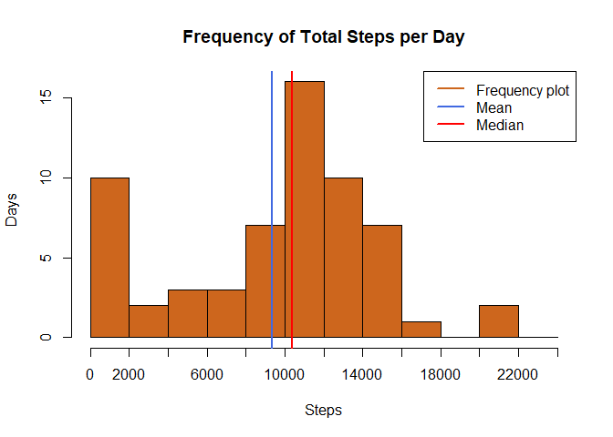
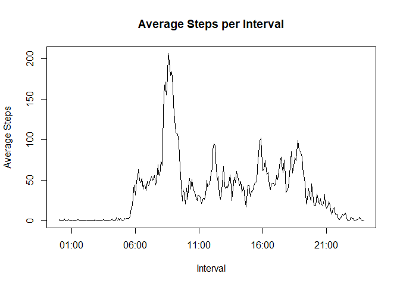
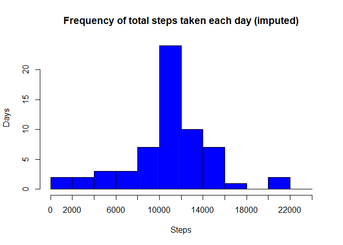
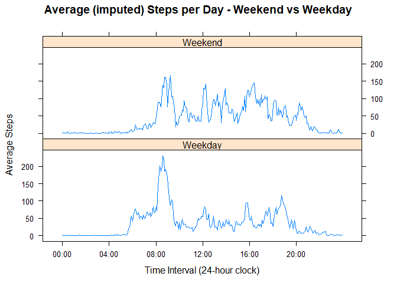

# Reproducible Research: Peer Assessment 1


## 1. Code for reading in the dataset and/or processing the data

a. Unzip data to obtain a csv file.

```r
setwd('C:/Users/chin tham sang/RepData_PeerAssessment1')
unzip("activity.zip",exdir = "data")
```

b. load into the masterfile and assign working data frame to work with

```r
Master_df <- read.table("data/activity.csv",
               header=TRUE,
               sep=",",
               stringsAsFactors = FALSE,
               colClasses = c("numeric","Date","numeric")
               )
working_df <- Master_df
```
c. Generate statistics to have an overview of the data

```r
summary(working_df)
```

```
##      steps             date               interval     
##  Min.   :  0.00   Min.   :2012-10-01   Min.   :   0.0  
##  1st Qu.:  0.00   1st Qu.:2012-10-16   1st Qu.: 588.8  
##  Median :  0.00   Median :2012-10-31   Median :1177.5  
##  Mean   : 37.38   Mean   :2012-10-31   Mean   :1177.5  
##  3rd Qu.: 12.00   3rd Qu.:2012-11-15   3rd Qu.:1766.2  
##  Max.   :806.00   Max.   :2012-11-30   Max.   :2355.0  
##  NA's   :2304
```

```r
str(working_df)
```

```
## 'data.frame':	17568 obs. of  3 variables:
##  $ steps   : num  NA NA NA NA NA NA NA NA NA NA ...
##  $ date    : Date, format: "2012-10-01" "2012-10-01" ...
##  $ interval: num  0 5 10 15 20 25 30 35 40 45 ...
```
## 2. Histogram of the total number of steps taken each day
- Calculate the totals the steps for each day
- plot a histogram total steps per day  
- calculate the mean and median total number of steps taken per day


```r
# calculate the totals steps for each day
TotalStepsByDay <- aggregate(working_df$steps,list(date=working_df$date),sum,na.rm=TRUE)
xAxisBreakdown = seq(from=0,to=25000,by=2000) 
# plot the histogram
hist(TotalStepsByDay$x,  #histogram
      breaks = xAxisBreakdown,
      main="Frequency of Total Steps per Day",
      col="chocolate3",
      xlab="Steps",
      ylab="Days",
      xaxt="n")
axis(side=1,at=xAxisBreakdown,labels=xAxisBreakdown)
# plot the mean
abline(v = mean(TotalStepsByDay$x,na.rm=T),
 col = "royalblue",
 lwd = 2)
step_Mean <- mean(TotalStepsByDay$x,na.rm=T)
# plot the median
abline(v = median(TotalStepsByDay$x,na.rm=T),
 col = "red",
 lwd = 2)
# add a legend 
legend(x = "topright", # location of legend within plot area
 c("Frequency plot", "Mean", "Median"),
 col = c("chocolate3", "royalblue", "red"),
 lwd = c(2, 2, 2))
```

<!-- -->

# 3. Mean and median number of steps taken each day


```r
step_Mean <- mean(TotalStepsByDay$x,na.rm=T)
step_Median <- median(TotalStepsByDay$x,na.rm=T)

cat(sprintf("The Mean number of steps per day is  ; %s\n",round(step_Mean,1)))
```

```
## The Mean number of steps per day is  ; 9354.2
```

```r
cat(sprintf("The Median number of steps per day is: %s\n",round(step_Median,1)))
```

```
## The Median number of steps per day is: 10395
```
## 4. Time Series plot of the average number of steps taken

- create a data frame that has the average steps per interval across all days.
- make a time series plot to see average activity rates throughout the day.
- to answer Which 5-minute interval, on average across all the days in the dataset, contains the maximum number of steps?

```r
#convert the 5-minute intervals into a time class; the next few steps will do that.
intHr <- working_df$interval %/% 100
intHr <- ifelse(intHr < 10,paste("0",intHr,sep=""),intHr)
#The minutes of the interval 
intMinutes <- working_df$interval %% 100
intMinutes <- ifelse(intMinutes < 10,paste("0",intMinutes,sep=""),intMinutes)
#Now put the minutes and hours together and convert to a time  
intTime <- paste(intHr,":",intMinutes,sep="")
intTime <- strptime(intTime,format="%H:%M")

#Now add the time variable back into the original data set
working_df <- cbind(working_df,intTime)

# compute the mean number of steps for each time interval and plot the result
SPI <- aggregate(working_df$steps,list(intTime=working_df$intTime),mean,na.rm=TRUE)

plot(SPI$intTime,SPI$x,
     type = "l",
     main = "Average Steps per Interval",
     xlab = "Interval",
     ylab = "Average Steps")
```

<!-- -->

##5. The 5-minute interval that, on average, contains the maximum number of steps

```r
#compute which interval has the highest average
MaxStepAvg <- max(SPI$x)
IntervalWithMaxStepAvg <- SPI$intTime[SPI$x == MaxStepAvg]
max_interval <- strftime(IntervalWithMaxStepAvg,"%H:%M:%S")

cat(sprintf("The Maximum 5 minutes interval occurs at : %s\n",max_interval))
```

```
## The Maximum 5 minutes interval occurs at : 08:35:00
```

```r
cat(sprintf("The Maximum steps per day at this time is: %s\n",round(MaxStepAvg,1)))
```

```
## The Maximum steps per day at this time is: 206.2
```


## 6 Code to describe and shows a strategy for imputing missing values

(a).  Calculate and report the number of missing values in the dataset. 
(b).  Strategy of imputation of missing value discussion
(c).  Create a dataset that replaces NA values with the mean for that interval.  
 

Part (a) extract missing values, total observations, compute the percentage of missing values and non-missing values

```r
countmissing <- sum(is.na(working_df$steps))
dims <- dim(working_df)
#cat(sprintf("Total Number of missing values : %s\n",countmissing))
num <- dims[1]
NApercentage<-(countmissing/num) * 100

cat(sprintf("Total Number of missing values : %s\n",countmissing))
```

```
## Total Number of missing values : 2304
```

```r
cat(sprintf("Total Number of observations   : %s\n",num))
```

```
## Total Number of observations   : 17568
```

```r
cat(sprintf("Percentage of missing Values   : %s\n",round(NApercentage,1),"%"))
```

```
## Percentage of missing Values   : 13.1
```

```r
cat(sprintf("Percentage of Accuracy         : %s\n",round(100-NApercentage,1),"%"))
```

```
## Percentage of Accuracy         : 86.9
```
Part (b) Missing Value Imputation Strategy
- Several R-Package cound be used, MICE, Amelia, MissForest, and etc
- impuatation using Mean, Since the variable for the assignment is on steps, we observed that the median and mean are quite closed, we can use mean imputation.

Part (c) Code for imputation using the mean


```r
#rename column "x" in data frame SPI 
names(SPI)[names(SPI)=="x"] <- "avgIntervalSteps"

#merge the average back into the dataframe by intTime
WithAvg_df <- merge(x=working_df,y=SPI,by="intTime",all.x=TRUE)

#reorder data
WithAvg_df <- WithAvg_df[order(WithAvg_df$date,WithAvg_df$intTime),]

#create column that uses the steps, if available, and the avgIntervalSteps otherwise.
WithAvg_df$imputedSteps <- ifelse(is.na(WithAvg_df$steps), 
                                 WithAvg_df$avgIntervalSteps,
                                 WithAvg_df$steps)
```

## 7 Histogram of the total number of steps taken each day after missing values are imputed


```r
TotalStepsByDayImputed <- aggregate(WithAvg_df$imputedSteps,list(date=WithAvg_df$date),sum,na.rm=TRUE)
xAxisBreakdown = seq(from=0,to=25000,by=2000) 
hist(TotalStepsByDayImputed$x,
      breaks = xAxisBreakdown,
      main="Frequency of total steps taken each day (imputed)",
      col="blue",
      xlab="Steps",
      ylab="Days",
      xaxt="n")
axis(side=1,at=xAxisBreakdown,labels=xAxisBreakdown)
```

<!-- -->


```r
step_MeanImputed <- mean(TotalStepsByDayImputed$x,na.rm=T)
step_MedianImputed <- median(TotalStepsByDayImputed$x,na.rm=T)
cat(sprintf("The Mean number of steps per day is  ; %s\n",round(step_MeanImputed,1)))
```

```
## The Mean number of steps per day is  ; 10766.2
```

```r
cat(sprintf("The Median number of steps per day is: %s\n",round(step_MedianImputed,1)))
```

```
## The Median number of steps per day is: 10766.2
```
The mean and median have changed significantly. The 2304 misiing vlue has replaced observations of means; hence totals will naturally have a much stronger central tendency. 

## 8. Panel plot comparing the average number of steps taken per 5-minute interval across weekdays and weekends

Panel plot comparing the average number of steps taken per 5-minute interval across weekdays and weekends

(i) create a new variable for Weekend or Weekday, summary breakdown by weekend and weekday.
(ii) generate lattice plots for comparison

```r
WithAvg_df$weekday <- weekdays(WithAvg_df$date)
WithAvg_df$weekendFlag <- ifelse(WithAvg_df$weekday=="Saturday" | WithAvg_df$weekday=="Sunday","Weekend","Weekday")

#This line computes the average steps / day for weekend and weekdays
SPI2 <- aggregate(WithAvg_df$imputedSteps,list(intTime=WithAvg_df$intTime,weekendFlag=WithAvg_df$weekendFlag),mean,na.rm=TRUE)

#Before plotting, set up the sequence to appear on the x-axis

xn <- seq(min(WithAvg_df$intTime),max(WithAvg_df$intTime),by="4 hour")

#Draw the plot with the x-axis in HH:MM format
library(lattice)
xyplot(x~intTime|weekendFlag,
       data=SPI2,
       type="l",
       layout=c(1,2),
       xlab = "Time Interval (24-hour clock)",
       ylab = "Average Steps",
       main = "Average (imputed) Steps per Day - Weekend vs Weekday",
       scales=list(
                    x=list(
                            at=xn,
                            labels=format(xn,"%H:%M")
                            )
                  )
        )
```

<!-- -->

## 9 Are there differences in activity patterns between weekdays and weekends?

In general, there is a difference in activity in weekdays and weekend. On weekdays, the activity is started around 5:30 a.m and a large burst just after 8 am, it remains quite steady after 9:30 a.m till 8 p.m. On Weekend, a smaller burst of activity just after 8 a.m s compare to weekdays. Overall, weekends show more regular activity throughout the day. On weekends, a few peaks are observed, the morning, the afternnon and the evening.


